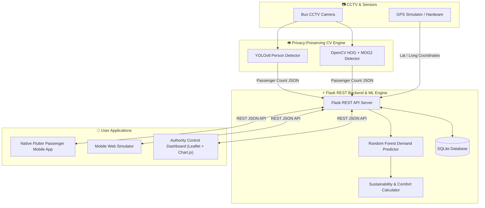

# 🚍 BusSense AI

> **Balancing Passenger Demand Across Public & Private Buses for Climate-Smart Mobility**

[](https://render.com)
[](https://vercel.com)
[](https://flutter.dev)
[](https://www.python.org)
[](https://scikit-learn.org)
[](https://ultralytics.com)
[](https://opencv.org)
[](LICENSE)
[](tests/test_analytics.py)

**BusSense AI** is an end-to-end intelligent transit management ecosystem. It uses **privacy-friendly Computer Vision (YOLOv8 & OpenCV)** on bus CCTV feeds to detect passenger density in real time, serving crowding analytics, seat availability probabilities, and AI recommendations to **passengers** via a **Native Flutter Mobile App** and to **transport authorities** via an **Executive Control Dashboard**.

---

## 🏗️ System Architecture



---

## 🛠️ Complete Technology Stack

| Layer | Technology | Version / Tool | Purpose & Usage |
| :--- | :--- | :--- | :--- |
| **Mobile App** | **Flutter / Dart** | `Flutter 3.x` | Cross-platform native passenger mobile application (Android & iOS) |
| | **Provider** | `^6.1.2` | Reactive state management for live bus feeds, theme modes, and language toggles |
| | **Google Fonts** | `Outfit` & `Plus Jakarta Sans` | High-aesthetic typography system and UI card hierarchy |
| **Authority Dashboard** | **HTML5 / Vanilla CSS3** | `CSS Variables / Glassmorphism` | Executive dashboard with dark/light mode and custom status badges |
| | **Leaflet.js** | `v1.9.4` | Interactive OpenStreetMap fleet tracking with custom KSRTC / Private bus markers |
| | **Chart.js** | `v4.4.1` | Route occupancy distribution & ML demand forecasting graphs |
| **Backend API** | **Python** | `3.10 / 3.11 / 3.14` | Core server platform |
| | **Flask** | `>=3.0.0` | Lightweight REST API web framework |
| | **Flask-CORS** | `>=4.0.0` | Cross-Origin Resource Sharing for Flutter and Web clients |
| | **SQLite3** | `3.x` | Relational database storing bus metadata, occupancy logs, and reports |
| | **Gunicorn** | `>=21.0.0` | High-performance production WSGI HTTP server |
| **Machine Learning** | **Scikit-Learn** | `>=1.5.0` | `RandomForestRegressor` for time-series passenger demand prediction |
| | **NumPy & Pandas** | `>=1.26.0`, `>=2.2.0` | High-speed data manipulation and numerical matrix operations |
| **Computer Vision** | **Ultralytics YOLOv8** | `>=8.2.0` | Deep neural network person-class object detector |
| | **OpenCV** | `>=4.10.0` | HOG Descriptor + MOG2 Background Subtractor fallback detector |
| **Cloud & Deployment** | **Render** | `Python Web Service` | 1-Click cloud app hosting with persistent WSGI server |
| | **Vercel** | `Serverless Functions` | Zero-config cloud serverless API functions |
| | **Docker** | `Dockerfile / Compose` | Multi-container Docker deployment |

---

## 🌟 Key Features

### 📱 1. Native Passenger Mobile App (`mobile_app_flutter/`)
- **Seat Availability & Occupancy Meter**: Displays live passenger crowding with Green / Yellow / Red badges, exact seat counts, and seat probability score.
- **Passenger Comfort Index**: Calculates trip comfort metrics based on bus capacity and passenger density.
- **Multilingual Support**: English & Malayalam UI localization toggle.
- **Less-Crowded Bus Recommendations**: Suggests alternative KSRTC or private buses running on the same route to prevent overcrowding.
- **Emergency Reporting & Crowding Feedback**: Integrated passenger reporting system for service delays and overcrowding.

### 📊 2. Executive Authority Control Dashboard (`dashboard/`)
- **Live Fleet Tracking Map**: OpenStreetMap Leaflet map displaying real-time positions of KSRTC public buses and private buses.
- **Random Forest Demand Forecasting**: Visualizes peak-hour crowding risks 15 to 60 minutes in advance.
- **One-Click Fleet Dispatch**: Allows dispatchers to trigger extra relief buses to overcrowded routes with instant UI feedback.
- **Environmental Impact Metrics**: Tracks fuel savings (liters) and carbon footprint reduction ($\text{kg CO}_2$).

### 👁️ 3. Privacy-Preserving Computer Vision Pipeline
- **Person-Class Only**: Counts passengers using bounding boxes without facial recognition, identity storage, or PII collection.
- **Dual Engine**: High-accuracy YOLOv8 neural network + lightweight OpenCV HOG fallback.

---

## 📐 Mathematical & Analytics Models

### 1. Passenger Comfort Index ($C$)
$$C = \max\left(0, \frac{\text{Capacity} - \text{Passenger Count}}{\text{Capacity}} \times 100\right)$$

### 2. Fleet Utilization Score ($U$)
$$U = \min\left(100, \frac{\text{Occupancy } \%}{85\%} \times 100\right)$$

### 3. Carbon Footprint Savings ($\text{CO}_2$)
$$\text{Fuel Saved (L)} = \text{Buses Shifted} \times \text{Route Distance (km)} \times 0.28\text{ L/km}$$
$$\text{CO}_2\text{ Reduction (kg)} = \text{Fuel Saved (L)} \times 2.68\text{ kg CO}_2/\text{L}$$

---

## ⚡ Setup & Deployment Guides

### Option A: Render Cloud Hosting (Recommended - 1-Click)

This repository includes a `render.yaml` Blueprint:

1. Log in to [Render Dashboard](https://dashboard.render.com).
2. Click **"New +"** $\rightarrow$ **"Web Service"**.
3. Connect your GitHub repository (`Antony0610/BusSense-AI`).
4. Set **Build Command**: `pip install -r requirements.txt`
5. Set **Start Command**: `python BusSenseAI/backend/app.py || python backend/app.py`
6. Click **Create Web Service**.

---

### Option B: Native Flutter Mobile App Setup

```bash
# Navigate to the Flutter app directory
cd mobile_app_flutter

# Fetch dependencies
flutter pub get

# Run on connected device or emulator
flutter run

# Build Production Release APK for Android
flutter build apk --release
```
> The built APK will be located at `mobile_app_flutter/build/app/outputs/flutter-apk/app-release.apk`.

---

### Option C: Local Backend Execution (Python)

```bash
# Clone the repository
git clone https://github.com/Antony0610/BusSense-AI.git
cd BusSense-AI

# Create virtual environment
python -m venv .venv

# Activate virtual environment
# Windows:
.\.venv\Scripts\activate
# Linux/macOS:
source .venv/bin/activate

# Install dependencies
pip install -r requirements.txt

# Launch Flask server
python backend/app.py
```

Access local endpoints:
- **Backend REST API**: <http://localhost:5000/api/health>
- **Authority Dashboard**: <http://localhost:5000/dashboard/index.html>
- **Passenger Web App**: <http://localhost:5000/mobile_app/index.html>

---

### Option D: Docker Deployment

```bash
docker compose up --build
```

---

## 📡 REST API Reference

| Method | Endpoint | Description | Sample Output |
| :--- | :--- | :--- | :--- |
| `GET` | `/api/health` | System status check | `{"status": "ok", "database": ".../bussense.db"}` |
| `GET` | `/api/buses` | Active bus fleet, live GPS, crowding, seat availability | `[{"bus_id": "KSRTC-101", "occupancy_percentage": 42.0, ...}]` |
| `GET` | `/api/stats` | Fleet utilization, alerts, fuel & CO₂ savings | `{"total_buses": 6, "fuel_saved_liters": 142.5, ...}` |
| `GET` | `/api/demand` | ML demand prediction insights by route | `[{"route_number": "R1", "predicted_occupancy": 82.5, ...}]` |
| `GET` | `/api/recommend-buses` | Less-crowded passenger bus recommendations | `{"recommended_bus": "PRIV-201", "available_seats": 28}` |
| `POST` | `/api/dispatch` | Authority dispatch trigger for extra relief buses | `{"message": "Dispatched extra KSRTC bus KSRTC-EXTRA-1"}` |
| `POST` | `/api/report` | Submit overcrowding report | `{"message": "report submitted"}` |

---

## 🧪 Testing & Verification

Execute unit tests for demand forecasting models, GPS trackers, and recommendation logic:

```bash
pytest tests/test_analytics.py
```

**Result**: `5 / 5 tests passed (100% success rate)`.

---

## 📁 Project Directory Structure

```text
BusSenseAI/
├── api/                      # Vercel Serverless Function entry point & requirements
├── backend/                  # Core Flask REST API & ML logic
│   ├── app.py                # Main Flask API server & SQLite database routes
│   ├── analytics.py          # Random Forest passenger demand forecasting
│   ├── gps_simulator.py      # Deterministic vehicle GPS tracker simulation
│   ├── recommendation.py     # Passenger seat probability & alternative route algorithms
│   └── sustainability.py   # Fuel efficiency & CO₂ reduction calculations
├── mobile_app_flutter/       # Native Flutter Mobile Application
│   ├── lib/
│   │   ├── models/           # JSON parsers & bus metrics model
│   │   ├── providers/        # State management (BusProvider with ChangeNotifier)
│   │   ├── screens/          # MainNavigation, Home, LiveTracking, ProfileSettings
│   │   ├── services/         # HTTP REST API client
│   │   ├── theme/            # AppTheme Material 3 design system & Google Fonts
│   │   └── widgets/          # Aesthetic BusCardWidget & custom UI components
│   └── pubspec.yaml          # Flutter dependencies configuration
├── dashboard/                # Authority Control Panel (HTML5 / CSS3 / JavaScript)
│   ├── index.html            # Dashboard UI structure
│   ├── styles.css            # Dark glassmorphism styling
│   └── app.js                # Leaflet maps, Chart.js graphs, & dispatch triggers
├── mobile_app/               # Passenger Web App Simulator (HTML/CSS/JS)
├── database/                 # Database scripts
│   ├── schema.sql            # SQLite relational table schemas
│   └── bussense.db           # Auto-seeded SQLite database
├── occupancy_detection/      # Computer vision detection pipeline
│   ├── detect_occupancy.py   # OpenCV HOG + MOG2 fallback detector
│   └── yolov8_detector.py   # YOLOv8 neural network person detector
├── datasets/                 # Demo datasets & CCTV synthetic video generator
├── tests/                    # Pytest unit testing suite
├── render.yaml               # Render 1-click Cloud Blueprint configuration
├── vercel.json               # Vercel deployment configuration
├── Dockerfile                # Docker container build script
└── README.md                 # Comprehensive project documentation
```

---

## 📄 License

Distributed under the MIT License. See `LICENSE` for details.

Developed with ❤️ for **Climate-Smart Public Mobility**.
